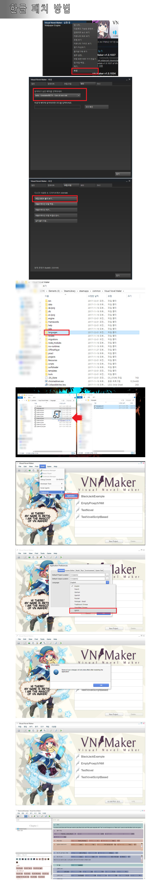

## 이미지 매핑 핫스팟 좌표
[구글 스프레드시트](https://docs.google.com/spreadsheets/d/1Wzdr7V8R3-jjvBFf1EJiAmM_EHg66rbNzSsvvarp1N8/edit?usp=sharing)

## Change Log
- 2017-12-01 17:27 (KST) - 'Live2D 설정' 커맨드에서 눈을 깜빡이는 설정하는 부분 수정(Eye Blink, Closed Motion, Closing Motion, Opening Motion)
- 2017-12-02 11:48 (KST) - Any (자동 회전) -> 임의로 선택
- 2017-12-05 16:14 (KST) - [캐릭터] 장면 나가기(Exit Scene) -> 장면에서 캐릭터 제거
- 2017-12-15 16:04 (KST) :

```txt
P187 - '에(to)' -> ~
P191 - '제거 >' -> 삭제
P206 - "com.example.SampleExtension" ->""
P207 - "Sample Extension" -> 샘플 익스텐션
D1ADDA07K2478A4764SAB13E044C26BFE919 - "Aristo" -> ""
6108021BKFDEFA400BSADA0EA7E3C3502B4B - "Aristo 2" -> ""
F326C8CEK9714A487AS9C72E0DC655D94BC5 - "Futura" -> ""
5931785CK8C7AA4EECSA748E98D1C6F6A8A6 - "눈금으로 보기" -> 그리드 표시
16ADE8C7KC29BA4DDESA1DFE575A7C625D41 - \"(없음) -> ""
ED0E4CA1976D854C5F8AC810864A28AF3E22 - "비틀거리는 효과(Wobble)" -> 흔들림
DA61190939963742963810216A7BCE496C1B - "블러 효과(Blur)" -> 블러
322A2B56554536445E5ABA130AB588F93809 - "표현식 선택" -> "표정 선택"
C167CCAE6B95034BD0686DE82A7E61ABE04F - "순서가 지정된" -> 차례
E8475D0A2036664E5A08DA31E4512A1ED63B - "대화 표현 (다중 애니메이션)" -> 대화 시의 표정 (애니메이션은 복수)
424C37B7414407472D5AEA6734AB7766958F - "Provisioning Profile:" -> 프로비저닝 프로필:
1918AB8650AE3747ED298751EE5F87D42AEE - "Code Sign Identity:" -> 코드 서명 ID:
86CFD16D4BF4A34D04189BE23C59609692B3 - Development Team: -> 개발 팀:
92E34FBA9D041446201B000727A2DF70BDD9 - "Package Type:" -> 패키지 타입:
B762368E5C99C44A13693586425214FE0963 - "Shape" -> 형상
4B66B19661918348F378CEB12A44A8B0A94D - "클릭할 때" -> 클릭 시
C746AB6B64828049C559F8166BE46DB1B2D8 - "Key Store:" -> 키 스토어:
AB1892CF24E06348542B34C92F67C6565EBB - "Key Store Password:" -> 키 스토어 패스워드:
00101D823696B044E05B3F8405A97A32B146 - "Key Alias:" -> 키 앨리어스:
789020F53FCF5247287975C25C67526614EA - "Key Password:" > 키 패스워드:
E6937E90514C37424D7B636147FDDEFB1CBB - "호흡 모션 강도" -> 호흡의 정도
40EA095D062F9546FD4B42253E2CCCA666D7 - "대기 모션(Idle) 강도" -> 대기 정도
90791FCC34EDE440309BC978DC6D67A038F0 - "립싱크 민감도" -> 립싱크 감도
49D635AA7F533945031961C84E53DA47FC4A - "눈을 감고 있는 시간" -> 눈 감은 모션
80666DBD4B6550418F2ABD277A1D721274A3 - "눈을 감는데 걸리는 시간" -> 눈을 감고 있는 모션
AAC691DE7A7AA744C07987D1895C7BA401DC - "눈을 뜨는데 걸리는 시간" -> 눈을 뜨고 있는 모션
FD7EF6A29DCE65415D6B8733997391E98142 - "Three-Part 이미지" -> 3-파트 이미지
AEB0463C403244454D5838451B328881EFFA - "사용자 상호 작용" -> 사용자 조작
이외 새로운 번역 추가 (1.0.144 기반)

```

2018-02-05T13:26:52.009Z - 버그로 인하여 패치 적용 방법을 영어(English)에 덮어쓰는 걸로 변경했습니다.

## 패치 적용 방법

