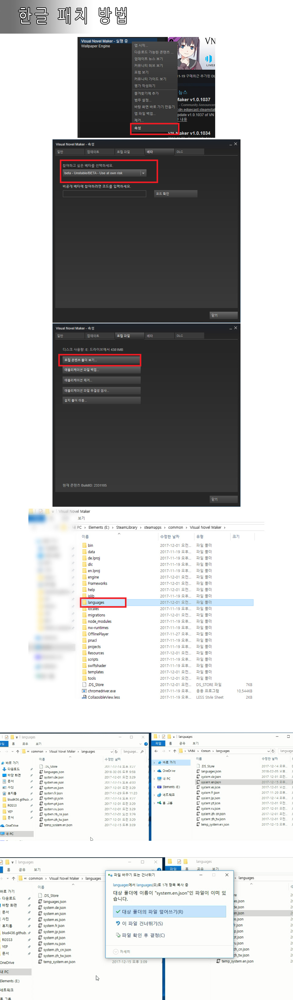

## 패치 적용 방법

## Change Log
- 2017-12-01 17:27 (KST) - 'Live2D 설정' 커맨드에서 눈을 깜빡이는 설정하는 부분 수정(Eye Blink, Closed Motion, Closing Motion, Opening Motion)
- 2017-12-02 11:48 (KST) - Any (자동 회전) -> 임의로 선택
- 2017-12-05 16:14 (KST) - [캐릭터] 장면 나가기(Exit Scene) -> 장면에서 캐릭터 제거